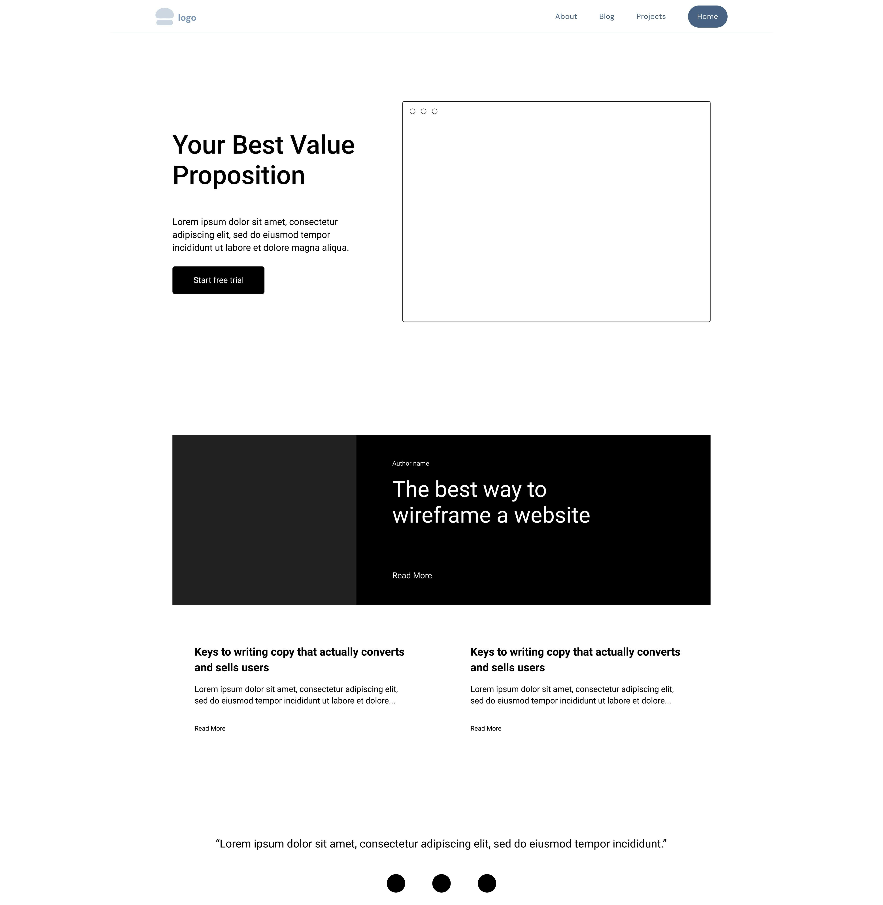

# README

## Portfolio Website
URL HERE
GITHUB REPO HERE

## Purpose

The purpose of the portfolio website is to present myself to prospective employers by showcasing my personality, skills, professional knowledge
and projects in an interactive manner. I'm aiming for a one-stop-shop for who I am and what I can do as a fullstack developer that gets straight to the point and
presented in an accessible website that is also aesthetically pleasing.

## Features

The site is very simple by design and I aim to keep it this way. There are 4 HTML documents that all link together:

 
 
 - Home page
 - About page
 - Blog page
 - Project page
 
Through these 4 pages, I will be able to effectively communicate the website's purpose. 

There is a responsive navigation bar that is fixed to the top of each page that adjusts on different screen sizes for accessibility:

This will be the main component to the website and crucial for navigating and accessing information which is why I decided to make it very prominently displayed
and have made it responsive for nearly all screen sizes.

Each page has a hero section with some type of image to communicate the purpose of the page displayed right at the top as I think it is a good way of capturing the audience's attention. I have created an image container that I reuse across nearly all the pages and have made this container responsive for ease of use if I want to add more images in the future.

Every section of all pages is enclosed in a responsive container that adjusts for many screen sizes. This is for ease of use and resuability if I want to add more content to a page. I have written the container first in the HTML with a section ID of "responsive-container".

This will also make it handy for accessibility and implementation as it easily divides each page into sections and I have set up many breakpoints for this container which made my life easier when adjusting each pages and its sections for a responsive layout.

The bottom of each page has a socials box with an image and link box that I can and have reused across all pages for ease of use if I decide to add more social media accounts/forms of contact. It also has a footer mainly for aesthetic purposes to nicely end the bottom of each page.

## Tech Stack

I have utilised a range of technology to make the website possible. This is a list of all tools used to plan, design and create the webpage:

### Design

-Figma
-Draw.io

### Implementation

-HTML5
-CSS3
-VS CODE

### Assets

https://imageresizer.com/
https://www.pexels.com/
https://pictogrammers.com/library/mdi/
https://fonts.google.com/

## Page Overview

Each page is structured like so; 

The navigation bar is seperated as a header. The main content of the page is seperated as the main section which is usually the most relevant information to the page title and generally the content the employer can immediately see at the top of the page. With the bottom of the page seperated as the footer. Any further content that isn't directly linked to the page title (eg. blog preview on the home page) is seperated as an article with groups of related information seperated as sections.

### Home Page

When I set out to create the home page, I wanted a quick introduction to myself at the top of the page with an image of myself so that the employer could get a face to the name and quickly understand that I have a positive work ethic with a button that links directly to the about page if they wanted more information from there to help flow to the next page naturally.

The next section is directly underneath with a list of blog posts, dates and links to the blog page itself.

My goal for the home page is for it to act as a landing page for all the pages of the website, with buttons under each section that will take you to it's respective page. I unfortunately ran out of time for the project page preview but will definitely be implementing that in the future.

I want the employer to flow through the page top to bottom and decide where they want to go next in a simple way whilst also being able to get a glimpse of what information the rest of the site will include.

This is a sitemap of how I want the home page to be navigated by the employer:

### About page, Blog page and Project page

My goal for these pages was to be more of a deep dive on the information provided on the home page. With the page title explaining the subject of each page. After creating all the pages and running out of time I realise that these 3 pages don't flow very well from one page to another. In the future I plan to implement a button or section at the bottom of each page that can either go back to the home page or move on to the next page for better flow and navigation of the site.

These are the sitemaps of how I want the remaining pages to be navigated by the employer:

I want the employer to be able to view all information relating to my personality at the top of the page as a more detailed introduction carrying the flow over from the home page. With my skills, work history and resume download underneath as supporting details.

I wanted this page to be fairly straight forward and simple, only containing my blogs with the recent entries at the top flowing down by date. 

Again, I also wanted this page to be similar to the blog page and only containing all my featured projects in the future.

My main goal for the structure of the entire site is for the information to be very clearly seperated by using margins and images to indicate that a new section has begun and to flow top to bottom like a book with my social links at the bottom of each page to easily contact me if the employer likes what they see.

After viewing many finished portfolio websites I could see a pattern throughout all of them. Navigation bar at the top, hero section right after it, further sections in between and a footer at the bottom to help guide the employer to the beginning and ending of each page.

I feel as though I have a lot of ideas on how to improve page structure and navigation by reflecting and writing about my decision making process. Page flow will need to be a higher priority in the sitemap creation process as I relied too much on having the navigation bar as a means of doing all the heavy lifting with navigating each page, which will definitely look and feel good on smaller screens but I feel wouldn't be as intuitive on wider screens.

## Wireframes and Aesthetics

I used figma for all my aesthetic planning and designing for the site.

I first started with a moodboard of colors, designs, hobbies and interests to get an idea of how I wanted to represent who I am as a person onto the site based on a simple brainstorm of keywords that would help with my vision for the site:

 - Simple
 - Clear 
 - Professional 
 - Dark colours
 - Modern
 - Computers
 - Warcraft
 - Cyberpunk
 - Cutting edge
 - Modern

I then visited a bunch of already created portfolio websites to get an idea of how those developers had designed the layout and look of their website and also saw patterns forming which helped me create a simple wireframe for each page.

I only made simple wireframes as I felt that high fidelity wireframes would take too long and since there isn't a huge amount of information and pages that need to be done for the entire site I would use them as only a guide for how I want the main components to be placed. I will detail under each wireframe how I ultimately made design changes to the website while using the wireframes as a base.

Starting with the home page, I wanted big bold headings that introduced me immediately with a profile picture that would let the employer put a face to the name. I designed the shape of the image to be circular so that it was very clearly a profile picture as most websites utilise round images for that purpose. I highlight any key information with a bright colour to make reading any title or block of text aesthetically pleasing and to break up information nicely. Using a dark background really makes the white letters pop and is easy on the eyes.

I wanted the about page to be very colorful as I wanted this page to be showcasing my personality. I shared my hobbies, where I live and my favourite quote from a character on a TV show that I enjoy which the employer can also relate to a positive work ethic. Big bold headings again were utilised with color throughout all text. The skills section is also very colorful with individual tools and languages highlighted with an accent colour and a white border to help them pop on the screen. I display my work history with a big bright red button to download my resume that is very inviting. 

I made the colours throughout the website based on the moodboard and incorporating them in a sleek and modern fashion for employers. My font choice was something that looked great in bold and in regular font weighting and also wanted something familiar and professional looking. Ultimately deciding on the "Barlow" font for its versatility and aesthetics. It looked like a completely different font based on the font weighting which I loved.

The blog page was very simple, I wanted it to be mainly for reading my thoughts so I didn't want too much color to distract from the big blocks of text that will be put in there. Ending each blog post with an image that relates to the blog subject, I feel breaks the page up nicely and makes it a little more interesting.

My favourite page is the project page. I wanted this to also be very colorful with a lot of images to get the employer excited about my work. It's a good way to showcase your hard work with a page that really pops. I wanted huge images of any projects with big colorful boxes for the tech/tools used with big, bright red inviting buttons to review the code or see it in action. When I have portfolio projects to showcase I'm plan to lay out the image and text boxes to be opposite from each other as they take up space going down on the page to really make the page interesting.

I utilised a real time colour website for colour placement:

https://www.realtimecolors.com/?colors=ffffff-0a0a0a-a30005-0077ff-4f4f4f&fonts=Poppins-Poppins

To help me layout and breakup colors by text, background, primary, secondary and accent based off my moodboard and personality. This helped massively with a professional and simple presentation of colours throughout the site.

## Components

These are a list of all the components I reused throughout the site:

 - Nav bar and nav item
 - Socials link and image
 - Hero content and hero text
 - Image container
 - Skills container and skills box(es)
 - Responsive container
 - Footer container
 
These components will be commented into the HTML and CSS. 

With the navigation bar and footer/socials links, I wanted them consistent across all pages to fully represent the start and end of a page. I made the navigation bar transparent to add a nice effect as you scroll through the page with the navigation links to be in the top right corner for larger screens and then positioned in the middle for smaller screens to be eyecatching for ease of navigation and aesthetic purposes. All the icons I've used are bright colours that really pop off the dark background. I have aligned the containers to be wider than the rest of the content to help divide the content aesthetically.

With the hero content and hero text I also wanted them consistent across mulitple pages to represent the main section of the page for accessibility and organisation. For the most part these are the eye catching sections of the page so all text is centered.

The image container was very useful in helping me place images on any page, I had the width and height at 100% and object-fit set to fill for the styling so that the images could be placed basically anywhere and will scale and look good up to a certain point. Usually with the bigger images that were in jpeg and png format I had the display set to none on smaller screens as it didn't scale well.

The skills container and skills boxes were also very helpful in placing images of tech around for the about page and project pages. I set the display to flex for the container and arranged them in the center to line up perfectly with the layout of the page. Displaying them in a bordered box looked great for aesthetic purposes and helped make them pop on the screen. I set the display properties to flex, flex-wrap and centered all the content to help keep them organised and aligned with a 1rem gap in between the boxes to seperate them. 

The responsive container was the star of the project, while building the site I had a border turned on and it helped me visually place all the sections and elements on the site at many different breakpoints. This isn't something that can be seen by the viewer but was incredibly instrumental in helping me build the entire site and without it would have made the whole process very frustrating. I placed the responsive container on the most outer part of every section in HTML to help seperate every section.

